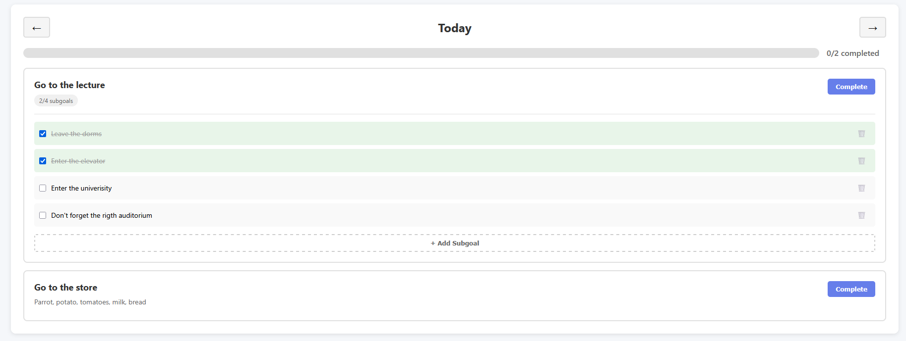

# Goal Tracker

**A Duolingo-style goal tracking web app with streaks, gems, and calendar visualization to help users build consistent habits.**

---

## Demo

### Dashboard with Calendar View

*Track your daily goals and maintain your streak!*


### Day View with Subgoals

*Break down big goals into manageable subgoals and track progress for each day!*


---

## Product Context

### End Users
- People who want to build consistent daily habits
- People that looking to track personal goals and maintain motivation
- Users who enjoy gamified productivity tools (similar to Duolingo users)

### Problem
People struggle to maintain consistency with their goals. Without proper tracking and motivation, it's easy to lose track of progress, break streaks, and lose motivation. Traditional todo lists don't provide the visual motivation and gamification needed to build long-term habits.

### Our Solution
Goal Tracker combines the addictive streak system with personal goal tracking:
- **Visual calendar heatmap** shows your progress at a glance
- **Streak system** motivates you to complete goals every day
- **Gems economy** rewards you for completing goals
- **Streak freezes** give you flexibility when life gets busy
- **Subgoals** help you break down complex goals into manageable tasks

---

## Features

### ✅ Implemented Features

#### User Management
- ✅ User registration and login with JWT authentication
- ✅ Secure password hashing (pbkdf2_sha256)
- ✅ Session management with token-based auth

#### Goal Management
- ✅ Add daily recurring goals (appear every day)
- ✅ Add one-time goals for specific dates
- ✅ Mark goals as complete
- ✅ Delete goals
- ✅ Goal descriptions for context

#### SubGoals
- ✅ Add subgoals to break down complex goals
- ✅ Track subgoal completion per day (independent per date)
- ✅ Complete/uncomplete subgoals
- ✅ Delete subgoals
- ✅ Visual progress tracking (X/Y completed)

#### Gamification System
- ✅ **Streak tracking** - Count consecutive days with all goals completed
- ✅ **Gems economy** - Earn 1 gem per completed goal
- ✅ **Streak freezes** - Purchase for 5 gems to protect your streak
- ✅ Use freezes to skip a day without breaking streak

#### Calendar & Visualization
- ✅ **Duolingo-style calendar heatmap** with color coding:
  - Gray: No goals
  - Yellow: <50% completed
  - Orange: 50-99% completed
  - Green: 100% completed
- ✅ Click any day to view detailed progress
- ✅ Navigate between days with arrows
- ✅ Date-specific goal completion tracking

#### Date Management
- ✅ Goals filtered by selected calendar date
- ✅ Daily goals appear from creation date forward
- ✅ One-time goals appear only on scheduled date
- ✅ Can't complete goals in the future
- ✅ Can't add one-time goals in the past

#### UI/UX
- ✅ Beautiful modern interface with gradients
- ✅ Toast notifications (success/error/info)
- ✅ Custom confirmation modals
- ✅ Responsive design
- ✅ Real-time updates
- ✅ Desktop app mode (Edge/Chrome app mode)

Not Yet Implemented
[ ] Email verification for new accounts
[ ] Password reset functionality
[ ] Push notifications
[ ] Goal categories/tags
[ ] Statistics and analytics dashboard
[ ] Social features (share streaks with friends)
[ ] Mobile app (iOS/Android)
[ ] Dark mode
[ ] Export data (CSV/PDF)
[ ] Custom freeze cost based on streak length
[ ] Goal templates
[ ] Recurring goals with custom patterns (e.g., every Monday/Wednesday)
[ ] User profiles and avatars
[ ] Achievement badges
[ ] Leaderboards


## 🚀 Usage

### Quick Start (3 Steps)

1. **Setup** (First time only)
   ```bash
   # Double-click or run:
   setup.bat
   ```
   This will automatically install Python, Node.js, and all dependencies if missing.

2. **Start the App**
   ```bash
   # Double-click or run:
   start.bat
   ```
   This opens two terminal windows:
   - Backend server (port 8000)
   - Frontend server (port 3000)

3. **Use the App**
   - Open http://localhost:3000 (for now) or any other server
   - Register a new account
   - Add your first goals
   - Complete them daily to build streaks!

### Daily Workflow

1. **Morning**: Open the app and check your goals for today
2. **Throughout the day**: Mark goals as complete as you accomplish them
3. **Add subgoals**: Break down complex goals into smaller tasks
4. **Track progress**: View your calendar to see your completion history
5. **Buy freezes**: If you know you'll miss a day, buy a freeze in advance!

---

## 🐳 Deployment

### Option 1: Docker (Recommended)

**Requirements:**
- Ubuntu 24.04 (or any OS with Docker installed)
- Docker Engine 20.10+
- Docker Compose 2.0+

**Step-by-step deployment:**

```bash
# 1. Clone the repository
git clone https://github.com/inno-se-toolkit/se-toolkit-hackathon.git
cd se-toolkit-hackathon

# 2. Start all services
docker-compose up -d

# 3. Verify services are running
docker-compose ps

# 4. Check logs (optional)
docker-compose logs -f
```

**Access the app:**
- Frontend: http://your-server-ip
- Backend API: http://your-server-ip:8000
- API Documentation: http://your-server-ip:8000/docs

**Stop the app:**
```bash
docker-compose down
```

**Update the app:**
```bash
git pull
docker-compose build --no-cache
docker-compose up -d
```

### Option 2: Manual Deployment (Ubuntu 24.04)

**Requirements:**
- Ubuntu 24.04 LTS
- Python 3.8+
- Node.js 16+
- npm or yarn

**Installation:**

```bash
# 1. Update system
sudo apt update && sudo apt upgrade -y

# 2. Install Python
sudo apt install python3 python3-pip -y

# 3. Install Node.js
curl -fsSL https://deb.nodesource.com/setup_20.x | sudo -E bash -
sudo apt install -y nodejs

# 4. Install PM2 (process manager)
sudo npm install -g pm2

# 5. Clone repository
git clone https://github.com/inno-se-toolkit/se-toolkit-hackathon.git
cd se-toolkit-hackathon

# 6. Setup backend
cd backend
pip3 install -r requirements.txt
cd ..

# 7. Setup frontend
cd frontend
npm install
npm run build
cd ..
```

**Deploy with PM2:**

```bash
# Create ecosystem config
cat > ecosystem.config.js << 'EOF'
module.exports = {
  apps: [
    {
      name: 'goal-tracker-backend',
      cwd: './backend',
      script: 'python3',
      args: 'main.py',
      env: {
        SECRET_KEY: 'your-production-secret-key',
        DATABASE_URL: 'sqlite:///./goal_tracker.db'
      },
      instances: 1,
      autorestart: true,
      watch: false,
      max_memory_restart: '500M'
    },
    {
      name: 'goal-tracker-frontend',
      cwd: './frontend',
      script: 'serve',
      args: '-s build -p 3000',
      env: {
        NODE_ENV: 'production'
      },
      instances: 1,
      autorestart: true,
      watch: false,
      max_memory_restart: '300M'
    }
  ]
};
EOF

# Install serve for frontend
npm install -g serve

# Start services
pm2 start ecosystem.config.js

# Save PM2 configuration
pm2 save

# Setup PM2 to start on boot
pm2 startup
```

**Setup Nginx Reverse Proxy:**

```bash
# Install nginx
sudo apt install nginx -y

# Create nginx config
sudo tee /etc/nginx/sites-available/goal-tracker << 'EOF'
server {
    listen 80;
    server_name your-domain.com;

    # Frontend
    location / {
        proxy_pass http://localhost:3000;
        proxy_http_version 1.1;
        proxy_set_header Upgrade $http_upgrade;
        proxy_set_header Connection 'upgrade';
        proxy_set_header Host $host;
        proxy_cache_bypass $http_upgrade;
        proxy_set_header X-Real-IP $remote_addr;
        proxy_set_header X-Forwarded-For $proxy_add_x_forwarded_for;
    }

    # Backend API
    location /api {
        proxy_pass http://localhost:8000;
        proxy_http_version 1.1;
        proxy_set_header Upgrade $http_upgrade;
        proxy_set_header Connection 'upgrade';
        proxy_set_header Host $host;
        proxy_cache_bypass $http_upgrade;
        proxy_set_header X-Real-IP $remote_addr;
        proxy_set_header X-Forwarded-For $proxy_add_x_forwarded_for;
    }
}
EOF

# Enable site
sudo ln -s /etc/nginx/sites-available/goal-tracker /etc/nginx/sites-enabled/
sudo nginx -t
sudo systemctl restart nginx

# Enable firewall
sudo ufw allow 'Nginx Full'
sudo ufw enable
```

### Option 3: Development Mode

For local development:

```bash
# Terminal 1 - Backend
cd backend
python main.py

# Terminal 2 - Frontend
cd frontend
npm start
```

---

## 🏗️ Technology Stack

### Backend
- **FastAPI** - Modern, fast Python web framework
- **SQLAlchemy** - SQL toolkit and ORM
- **SQLite** - Lightweight database (can be changed to PostgreSQL/MySQL)
- **Pydantic** - Data validation
- **python-jose** - JWT authentication
- **passlib** - Password hashing

### Frontend
- **React 18** - UI library
- **TypeScript** - Type safety
- **React Router** - Client-side routing
- **Axios** - HTTP client
- **CSS3** - Modern styling with gradients and animations

### DevOps
- **Docker** - Containerization
- **Docker Compose** - Multi-container orchestration
- **Nginx** - Reverse proxy and static file serving
- **PM2** - Node.js process manager (alternative deployment)

---

## 📊 API Documentation

Interactive API documentation available at:
- Swagger UI: http://localhost:8000/docs
- ReDoc: http://localhost:8000/redoc

### Key Endpoints

**Authentication:**
- `POST /api/auth/register` - Create account
- `POST /api/auth/login` - Login
- `GET /api/auth/me` - Get current user

**Goals:**
- `GET /api/goals` - Get all goals
- `POST /api/goals` - Create goal
- `DELETE /api/goals/{id}` - Delete goal
- `POST /api/goals/{id}/complete` - Mark complete

**SubGoals:**
- `POST /api/subgoals` - Create subgoal
- `PUT /api/subgoals/{id}/complete` - Complete subgoal
- `DELETE /api/subgoals/{id}` - Delete subgoal

**Calendar:**
- `GET /api/calendar/{year}/{month}` - Get calendar data
- `GET /api/day/{date}` - Get day view

**Stats:**
- `GET /api/stats` - Get streak, gems, freezes
- `POST /api/freeze/purchase` - Buy freeze (5 gems)
- `POST /api/freeze/use` - Use freeze

---

## 📁 Project Structure

```
se-toolkit-hackathon/
├── backend/
│   ├── Dockerfile              # Backend container config
│   ├── main.py                 # FastAPI app and routes
│   ├── database.py             # Database configuration
│   ├── models.py               # SQLAlchemy models
│   ├── schemas.py              # Pydantic schemas
│   ├── auth.py                 # Authentication
│   ├── services.py             # Business logic
│   └── requirements.txt        # Python dependencies
├── frontend/
│   ├── Dockerfile              # Frontend container config
│   ├── nginx.conf              # Nginx configuration
│   ├── public/                 # Static assets
│   └── src/
│       ├── api/                # API client
│       ├── components/         # Reusable components
│       ├── contexts/           # React contexts
│       ├── pages/              # Page components
│       ├── types/              # TypeScript types
│       ├── App.tsx             # Main app
│       └── index.css           # Global styles
├── docker-compose.yml          # Docker orchestration
├── setup.bat                   # Windows setup script
├── start.bat                   # Windows start script
├── Goal Tracker.bat            # Desktop app launcher
├── desktop_app.py              # Desktop app wrapper
└── README.md                   # This file
```

---

## 🔒 Security

- ✅ Password hashing with pbkdf2_sha256
- ✅ JWT token authentication
- ✅ CORS configuration for frontend
- ✅ Input validation with Pydantic
- ✅ SQL injection protection (SQLAlchemy ORM)
- ✅ Environment variables for secrets

**Production Checklist:**
- [ ] Change SECRET_KEY in environment variables
- [ ] Use PostgreSQL instead of SQLite
- [ ] Enable HTTPS/TLS
- [ ] Set up rate limiting
- [ ] Configure proper CORS origins
- [ ] Enable database backups
- [ ] Set up monitoring and logging

---

## 🤝 Contributing

1. Fork the repository
2. Create a feature branch (`git checkout -b feature/amazing-feature`)
3. Commit your changes (`git commit -m 'Add amazing feature'`)
4. Push to the branch (`git push origin feature/amazing-feature`)
5. Open a Pull Request

---

## 📄 License

This project is licensed under the MIT License - see the LICENSE file for details.

---
